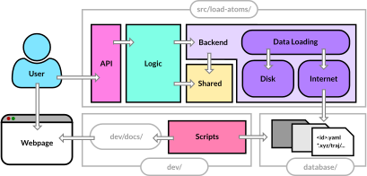

# Load-Atoms Design

The Load-Atoms package is comprised of several modules, forming 3 natural layers to the package:

Working from bottom to top, the layers are:

1. The **Backend** Layer: `load-atoms` allows users to donwload atomic datasets from the internet. Thus the backend is responsible for downloading and caching the data. The single function it exposes is `get_structures_for(datset_id, save_to)` which returns a list of `ase.Atoms` objects. The backend is implemented in the `load_atoms.backend` module.
2. The **Dataset** Layer: `load-atoms` provides a `Dataset` class which is a thin wrapper around a list of `ase.Atoms` objects. Several other convenience functions are provided for data manipulation. The dataset layer is implemented in the `load_atoms.dataset` module.
3. The **API** Layer: `load-atoms` exposes a single function `dataset` (which returns a `Dataset` object). The API layer is implemented in the `load_atoms.api` module.

To enable communication between the `Dataset` and `Backend` layers, the `DatsetInfo` and `DatasetId` interface classes are defined in their own, stand-alone module `load_atoms.dataset_info`.