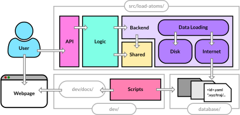

# Load-Atoms developer guide

## Overview

`load-atoms` is a python package that aims to make downloading and using atomistic datasets **as easy as possible for the user**.
Our role as developers is to maintain the code base, adding new features and fixing bugs as the need arises, all while ensuring the user experience remains as smooth as possible.

The following guide is intended to help you get set up to develop this package, and to give you an overview of the structure of the code base.
We place a heavy emphasis on testing as a means to ensure the code base remains stable and bug-free. 

## Package architecture and design

The `load-atoms` code (located at [src/load-atoms](../../src/load_atoms/)) is comprised of several modules, forming 3 natural layers to the package:



Working from bottom to top, these layers are:

1. The **Backend** Layer: `load-atoms` allows users to download atomic datasets from the internet. Thus the backend is responsible for downloading and caching the data. The single function this module exposes is [`get_structures_for(datset_id, root: Path)`](../../src/load_atoms/backend/__init__.py) which:
   - downloads all the necessary files from the internet (if necessary)
   - stores them in an easy to inspect format in the `root` directory
   - returns a list of all the datasets structures as `ase.Atoms` objects
2. The **Logic** Layer: `load-atoms` provides a [`Dataset`](../../src/load_atoms/dataset/__init__.py) class which is a thin wrapper around a list of `ase.Atoms` objects. Several other convenience functions are defined in this module for data manipulation.
3. The **API** Layer: this module is solely responsible for presenting a curated, well documented and user-friendly interface to the `load-atoms` package. The main function this exposes is `dataset`.

To enable communication between the `Dataset` and `Backend` layers, the `DatsetInfo` and `DatasetId` interface classes are defined in their own, stand-alone module `load_atoms.shared`.

## Dataset specification

`load-atoms` defines a specification for the metadata to be included with each dataset.
As an example of what one of these contains, see [database/C-GAP-17/C-GAP-17.yaml](../../database/C-GAP-17/C-GAP-17.yaml). 
The complete specification is defined programmatically in the [`DatasetInfo`](../../src/load_atoms/shared/dataset_info.py) class.

Alongside the `load-atoms` python code base, this repository also stores all the datasets that are available for download, each in its own directory in the [database](../../database) directory.

Adding a dataset to the database is as simple as creating a new directory, adding a `yaml` file containing the metadata for the dataset and submitting a pull request. See [adding-a-dataset.md](adding-a-dataset.md) for more details.

## Getting set up to develop

### 1. Clone the repo

```bash
git clone https://github.com/jla-gardner/load-atoms
cd load-atoms
```

### 2. Install dependencies

It is highly recommended that you use a virtual environment to develop this project.
Using `conda`, you can do:

```bash
conda create -n load-atoms python=3.8 -y
conda activate load-atoms
```

Once you've created a virtual environment, you can `pip install` this package, together with the necessary development tools, in a local and editable mode using:

```bash
pip install -e ".[dev]"
```

This project uses the `black` code formatter, together with `isort` to sort imports.
For this reason, it is highly recommended that you set up your editor to run `black` and `isort` on save. If using VSCode, installing the `isort` extension, together with adding the following to your `.vscode/settings.json` file, is enough to make this happen automatically.

```json
{
    ...
    "python.formatting.provider": "black",
    "[python]": {
        "editor.codeActionsOnSave": {
            "source.organizeImports": true
        },
        "editor.formatOnSave": true
    }
    ...
}
```

### 3. Test your installation

To test your installation, run:

```bash
pytest