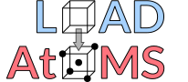

hidden
======

.. raw:: html
    :file: hide-title.html

.. important::

   This project is under active development. Until version 1.0.0 is released, breaking changes to the API may occur.

:code:`load-atoms` is a Python package for downloading, inspecting and manipulating datasets of atomic structures.

Quickstart
----------
Install using :code:`pip install load-atoms`, and then use 
:func:`~load_atoms.load_dataset` to download an :class:`~load_atoms.AtomsDataset` (full list available :doc:`here <database-summary>`):

   >>> from load_atoms import load_dataset
   >>> dataset = load_dataset("C-GAP-17")
   Downloading C-GAP-17.extxyz | ███████████████████████ | 100.0% 
   The C-GAP-17 dataset is covered by the CC BY-NC-SA 4.0 license.
   Please cite the C-GAP-17 dataset if you use it in your work.

These are thin wrappers around lists of :class:`ase.Atoms`:

   >>> dataset[0]
   Atoms(symbols='C64', pbc=True, cell=[9.483, 9.483, 9.483], force=...)

:func:`~load_atoms.view` provides interactive visualization of atomic structures:

   >>> from load_atoms import view
   >>> view(dataset[1926], show_bonds=True)

.. raw:: html
   :file: ./_static/c-gap-17-1926.html

We provide several :doc:`dataset-level operations <api/dataset>`:

   >>> small_structures = dataset.filter_by(lambda atoms: len(atoms) < 10)

   >>> dataset.info["energy"]
   array([-9847.662, -9886.44 , ...,  -632.465, -632.945])

   >>> trainset, testset = dataset.random_split([0.9, 0.1], seed=42)

.. toctree::
   :maxdepth: 1
   :hidden:

   Quickstart <self>

.. toctree::
   :maxdepth: 3
   :hidden:
   :caption: API Reference

   api/dataset
   api/viz
   api/utils

.. include:: datasets-index.rst

.. toctree::
   :maxdepth: 1
   :hidden:
   :caption: Contributing

   dev/developer-guide

